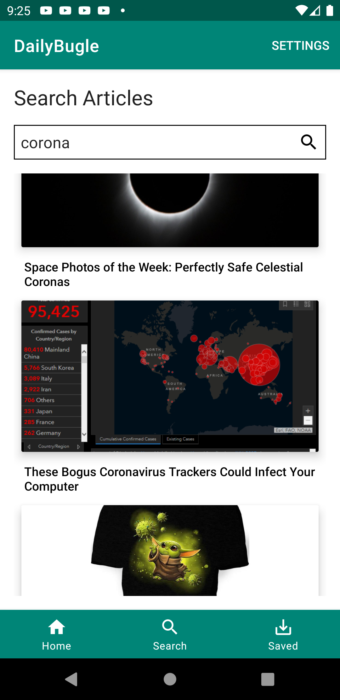
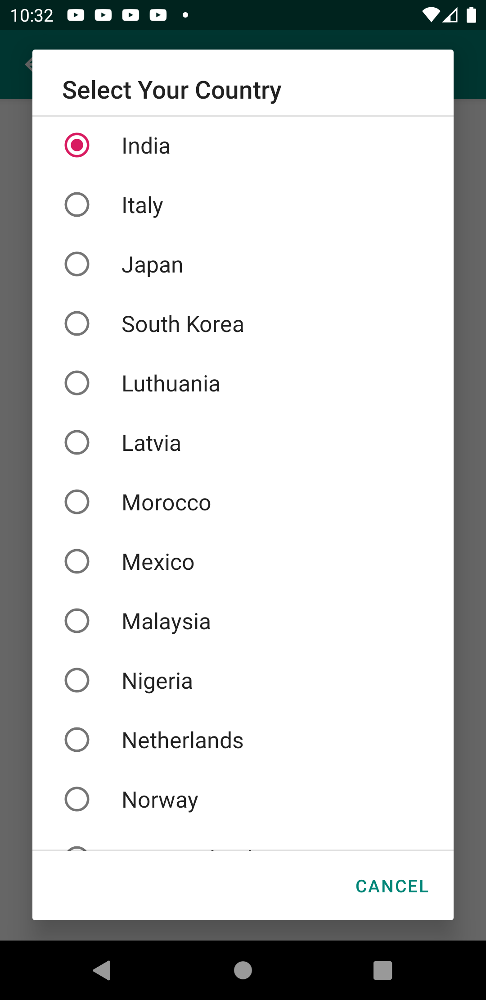
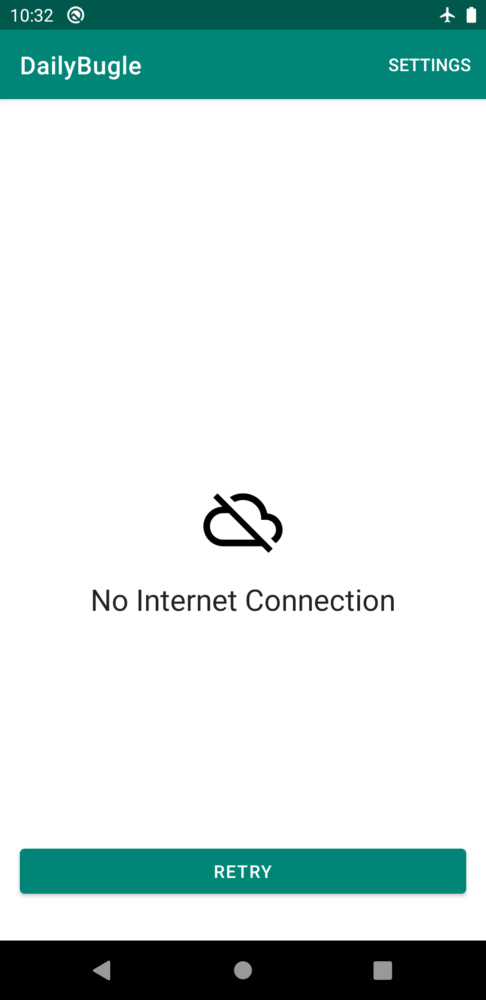

# 🕷️DailyBugle 

<a href='https://play.google.com/store/apps/details?id=com.prudhvir3ddy.dailybugle'></a>

[](https://circleci.com/gh/prudhvir3ddy/DailyBugle)
[](https://www.codacy.com?utm_source=github.com&amp;utm_medium=referral&amp;utm_content=prudhvir3ddy/DailyBugle&amp;utm_campaign=Badge_Grade)

## local setup instructions 
Go to <http://newsapi.org/> and generate your API key there and 
append to your local.properties like this

``` groovy
sdk.dir=YOUR_LOCAL_PATH_TO_ANDROID_SDK
api.news=ADD_YOUR_API_KEY_HERE

```

## screenshots 

<table>
  <tr>
    <td>Home Screen</td>
     <td>Search Screen</td>
     <td> Saved Articles </td>
  </tr>
  <tr>
    <td></td>
    <td></td>
    <td> Coming soon! </td>
  </tr>
    <tr>
    <td>Select country</td>
     <td>no internet</td>
  </tr>
  <tr>
    <td></td>
    <td></td>
  </tr>
 </table>
